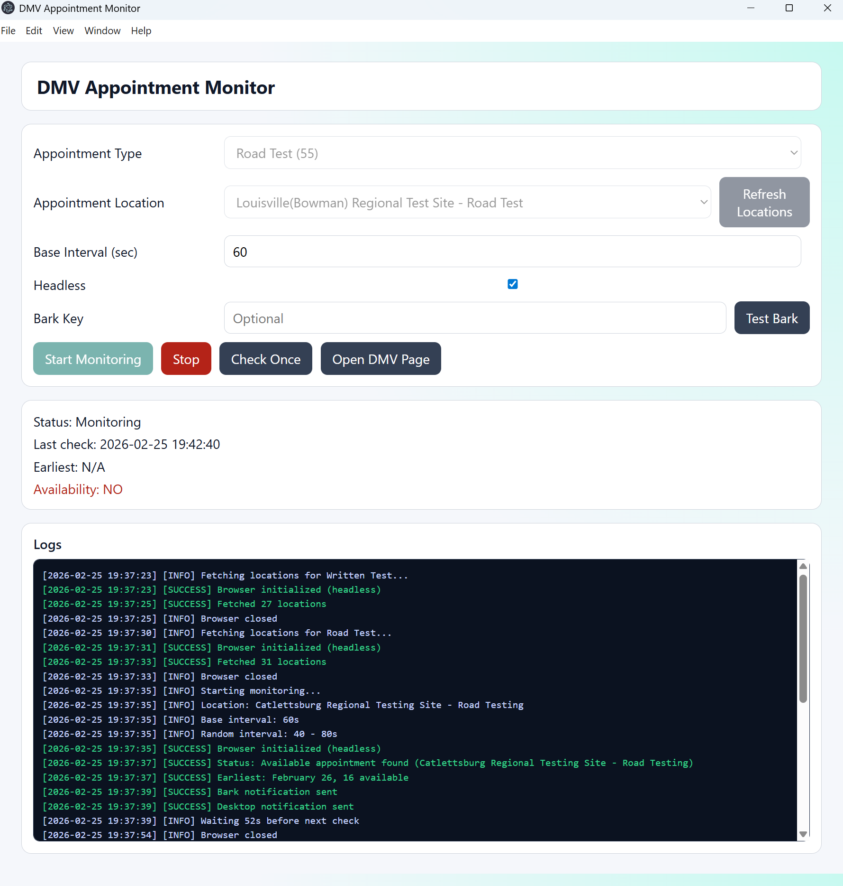

# DMV Appointment Monitor

[](https://github.com/agecspnt/louisville-dmv-appointment-monitor/actions/workflows/ci.yml)
[](https://github.com/agecspnt/louisville-dmv-appointment-monitor/actions/workflows/build-desktop.yml)
[](https://github.com/agecspnt/louisville-dmv-appointment-monitor/actions/workflows/release.yml)
[](https://github.com/agecspnt/louisville-dmv-appointment-monitor/releases)
[](https://github.com/agecspnt/louisville-dmv-appointment-monitor/stargazers)
[](https://github.com/agecspnt/louisville-dmv-appointment-monitor/forks)
[](https://github.com/agecspnt/louisville-dmv-appointment-monitor/issues)
[](https://github.com/agecspnt/louisville-dmv-appointment-monitor/commits/main)
[](https://github.com/agecspnt/louisville-dmv-appointment-monitor)
[](https://github.com/agecspnt/louisville-dmv-appointment-monitor)
[](./LICENSE)

English (default) | [简体中文](./README.zh-CN.md)

Desktop app built with Electron + Playwright to monitor Kentucky DMV appointment availability.

## App Preview

<p align="center">
  
</p>

<p align="center">
  <strong>Live Location Picker</strong> · <strong>Real Earliest Lookup</strong> · <strong>Green Success Logs</strong> · <strong>Bark Push Details</strong>
</p>

> The UI is designed for fast decision-making: select appointment type, choose a live location list, and monitor with earliest availability details visible in status/logs/notifications.

## Highlights

- Supports `Written Test (56)` and `Road Test (55)`.
- After choosing `Appointment Type`, the app fetches all live locations from DMV and lets you select one.
- Real availability check per selected location.
- Real click on `Check Earliest Availability` and extraction of earliest returned info (for example `February 26, 16 available`).
- When availability is found:
  - green success logs in UI
  - desktop notification
  - Bark push notification (with location, status, check time, earliest info)
- Build is test-gated: tests must pass before packaging.

## Requirements

- Node.js `>=20`
- npm

## Quick Start

```bash
npm install
npx playwright install chromium
npm start
```

## Scripts

- `npm test`
  Runs all tests, including live DMV web integration test.
- `npm run test:live`
  Runs only the live DMV integration test.
- `npm run build:win`
  Test-gated Windows build.
- `npm run build:all`
  Alias of Windows build flow (Windows only).

Windows helper:

- `build_auto.bat`
  Installs deps, installs Playwright Chromium, runs tests, then builds.

## Project Layout

- `electron/main.js`: scheduler, notifications, IPC handlers
- `electron/preload.js`: renderer bridge API
- `src/services/monitor.js`: scraping, parsing, location/availability logic
- `src/renderer/*`: UI
- `tests/*.test.js`: unit and live integration tests

## Notes

- This tool does not guarantee getting an appointment.
- Users are responsible for following DMV website terms and local regulations.

## Platform Support

This project is now Windows-only for build and release workflows.

## Star History

[](https://www.star-history.com/#agecspnt/louisville-dmv-appointment-monitor&type=date&legend=top-left)

## Contributing

See [CONTRIBUTING.md](./CONTRIBUTING.md).

## Security

Report vulnerabilities via [SECURITY.md](./SECURITY.md).

## License

MIT. See [LICENSE](./LICENSE).
