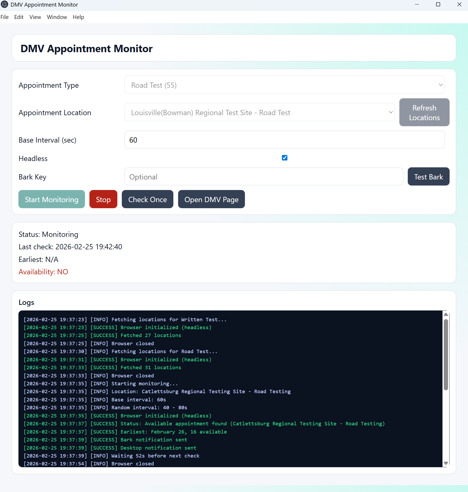

# DMV Appointment Monitor

[](https://github.com/agecspnt/louisville-dmv-appointment-monitor/actions/workflows/ci.yml)
[](https://github.com/agecspnt/louisville-dmv-appointment-monitor/actions/workflows/build-desktop.yml)
[](https://github.com/agecspnt/louisville-dmv-appointment-monitor/actions/workflows/release.yml)
[](https://github.com/agecspnt/louisville-dmv-appointment-monitor/releases)
[](https://github.com/agecspnt/louisville-dmv-appointment-monitor/stargazers)
[](https://github.com/agecspnt/louisville-dmv-appointment-monitor/forks)
[](https://github.com/agecspnt/louisville-dmv-appointment-monitor/issues)
[](https://github.com/agecspnt/louisville-dmv-appointment-monitor/commits/main)
[](https://github.com/agecspnt/louisville-dmv-appointment-monitor)
[](https://github.com/agecspnt/louisville-dmv-appointment-monitor)
[](./LICENSE)

English (default) | [简体中文](./README.zh-CN.md)

Desktop app built with Electron + Playwright to monitor Kentucky DMV appointment availability and optionally auto-book real appointment slots.

## App Preview

<p align="center">
  
</p>

<p align="center">
  <strong>Live Location Picker</strong> · <strong>Real Earliest Lookup</strong> · <strong>Auto Book / Auto Submit</strong> · <strong>Bark Push Details</strong>
</p>

> The UI is designed for fast decision-making: select appointment type, choose a live location list, and monitor with earliest availability details visible in status/logs/notifications.

## Highlights

- Supports `Written Test (56)` and `Road Test (55)`.
- After choosing `Appointment Type`, the app fetches all live locations from DMV and lets you select one.
- Real availability check per selected location.
- Real click on `Check Earliest Availability` and extraction of earliest returned info (for example `February 26, 16 available`).
- Optional real auto-booking flow:
  - open the selected location
  - choose the earliest available in-person slot
  - fill applicant information
  - optionally auto-submit the reservation
- `Book Earliest Now` button for immediate booking attempts without waiting for the scheduler.
- Applicant information is kept in memory only for the current app session.
- When availability is found:
  - green success logs in UI
  - desktop notification
  - Bark push notification (with location, status, check time, earliest info)
- Windows release builds now bundle the required Playwright Chromium runtime instead of depending on a per-user cache.
- Build is test-gated: tests must pass before packaging.

## Requirements

- Node.js `>=20`
- npm

## Quick Start

```bash
npm install
npm run install:browsers
npm start
```

## Download

Windows builds are published in [GitHub Releases](https://github.com/agecspnt/louisville-dmv-appointment-monitor/releases).

1. Open the latest release page.
2. In `Assets`, download the Windows installer or portable package.
3. Run the downloaded file on Windows. As of `v1.0.2`, the release bundles Chromium so the app does not rely on an existing Playwright cache on that machine.

## Auto-booking Setup

1. Select `Road Test (55)` or `Written Test (56)`.
2. Pick a live appointment location.
3. Fill in applicant info:
   - `First Name`
   - `Last Name`
   - `Email`
   - `Phone`
   - `Receive Texts` (optional)
4. Choose one mode:
   - `Auto Book` + `Auto Submit` = monitor and automatically submit when a slot is found.
   - `Auto Book` only = monitor, reserve the slot, fill the form, and stop before final submission.
5. Use `Book Earliest Now` if you want to immediately attempt the earliest available slot at the currently selected location.

## Important Notes About Auto-booking

- Auto-booking follows the live Kentucky DMV flow. It can create a real appointment.
- `Auto Submit` should only be enabled when you are comfortable with the app submitting the reservation on your behalf.
- Availability can disappear between detection and submission if another user takes the slot first.
- Some locations still have special county restrictions or call-in-only rules shown by the DMV site.

## Bark Setup

This app can send Bark push notifications when an appointment becomes available.

1. Install Bark on your iPhone and open the app.
2. Copy your device key from Bark. The project sends notifications through `https://api.day.app/<your-key>/...`.
3. Start the desktop app with `npm start`.
4. Paste the key into the `Bark Key` field.
5. Click `Test Bark` to verify that your phone can receive a test notification. If the field is empty, the test will fail.
6. Start monitoring. When availability is detected, the app will send a Bark push with the location, status, check time, and earliest availability.

Reference: [Bark official site](https://bark.day.app/#/)

## Scripts

- `npm run install:browsers`
  Installs Chromium into a hermetic local Playwright folder used for packaged Windows builds.
- `npm test`
  Runs all tests, including live DMV web integration test.
- `npm run test:live`
  Runs only the live DMV integration test.
- `npm run build:win`
  Test-gated Windows build.
- `npm run build:all`
  Alias of Windows build flow (Windows only).

Windows helper:

- `build_auto.bat`
  Installs deps, installs Playwright Chromium, runs tests, then builds.

## Project Layout

- `electron/main.js`: scheduler, notifications, IPC handlers
- `electron/preload.js`: renderer bridge API
- `src/services/monitor.js`: scraping, parsing, location/availability logic, and real booking flow
- `src/renderer/*`: UI
- `tests/*.test.js`: unit and live integration tests

## Notes

- This tool does not guarantee getting an appointment.
- Users are responsible for following DMV website terms and local regulations.

## Platform Support

This project is now Windows-only for build and release workflows. Download packaged builds from [Releases](https://github.com/agecspnt/louisville-dmv-appointment-monitor/releases).

## Star History

[](https://www.star-history.com/#agecspnt/louisville-dmv-appointment-monitor&type=date&legend=top-left)

## Contributing

See [CONTRIBUTING.md](./CONTRIBUTING.md).

## Security

Report vulnerabilities via [SECURITY.md](./SECURITY.md).

## License

MIT. See [LICENSE](./LICENSE).
